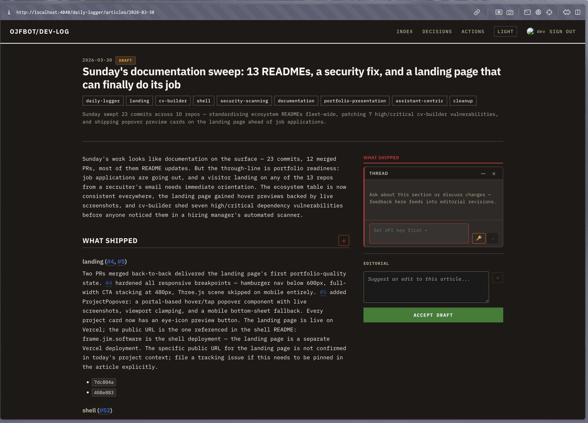

# ADR-0038: Editorial Revision Workflow — LLM-Applied Feedback via CI

Date: 2026-03-30
Status: Accepted
OKR: 2026-Q1 / O1 / KR3 (editorial workflow)
Commands affected: /validate, /deploy
Repos affected: daily-logger
Linked: ADR-0037 (editorial stamp workflow), ADR-0035 (article status lifecycle)

---

## Context

ADR-0037 introduced the editorial stamp workflow: an authorized user reviews a draft article in the React frontend and clicks "Accept Draft" to open a PR that changes `status: draft → accepted`. ADR-0037 only handled acceptance — if the article needed corrections, the user had to edit the markdown manually via GitHub.

The React editorial UI now supports two feedback mechanisms:

1. **Section-level chat threads** — the `+` button on each `## h2` heading opens a chat thread. Users type corrections, questions, or observations about specific sections.
2. **Root-level edit suggestions** — a textarea in the editorial sidebar for article-wide feedback (e.g., "the summary says 12 merged PRs but there were only 10").

When feedback exists, the frontend's "ACCEPT WITH REVISIONS" button creates a PR with structured feedback embedded in the PR body between HTML comment markers:

```
<!-- EDITORIAL_FEEDBACK_START -->
## Root-level edit suggestion
Fix the summary — it says 12 merged PRs but there were only 10.

---

## Section: What shipped
- The landing page URL is wrong, it should be jim.software not frame.jim.software
<!-- EDITORIAL_FEEDBACK_END -->
```

We need CI automation to extract this feedback, apply it to the article via Claude, and push the result back to the PR branch — closing the feedback loop without manual markdown editing.

## Decision

### Architecture

A new GitHub Actions workflow (`editorial-revise.yml`) fires on `accept/*` PRs containing editorial feedback markers. A standalone TypeScript script (`src/revise-article.ts`) handles the LLM call.

```
User clicks "Accept with Revisions"
  → stampDraft() creates PR on accept/YYYY-MM-DD
  → PR body contains feedback between markers
  → CI workflow triggers
  → Extract feedback from PR body
  → Read article from branch
  → Claude revise_article tool_use call
  → Commit revised article to same branch
  → Post summary comment on PR
  → Human merges when satisfied
```

### Revision script: `src/revise-article.ts`

Standalone entry point: `tsx src/revise-article.ts`

Accepts env vars: `ARTICLE_PATH`, `EDITORIAL_FEEDBACK`, `ANTHROPIC_API_KEY`, `DRY_RUN`, `MOCK_LLM`

Uses the same `tool_use` pattern as `generate-article.ts`:
- Model: `claude-sonnet-4-6`
- Tool: `revise_article` → `{ revisedMarkdown: string, changesSummary: string[] }`
- `tool_choice: { type: 'tool', name: 'revise_article' }`
- `max_tokens: 8192`

The system prompt is deliberately minimal (~500 chars vs. the 11k generation prompt). The revision call does not need repo context, pillar references, or writing style instructions — the article already embodies those. The prompt focuses on:
- Apply ONLY requested changes
- Preserve voice, structure, frontmatter, formatting
- Return full revised article (not a diff)
- Explain each change in `changesSummary`

### Why not re-run the council?

The council (4 persona reviews + synthesis) is designed for first-draft quality improvement. Editorial revisions are targeted, human-directed corrections. Re-running the council would:
- Add 5+ API calls per revision
- Risk undoing the human's specific corrections
- Add minutes to a workflow that should complete in ~30 seconds

### Loop prevention (3 layers)

1. **Event type filtering**: The workflow triggers on `opened` and `edited` (PR body changes). Pushing a commit to the branch fires `synchronize`, not `edited`, so the bot's own commit cannot re-trigger the workflow.
2. **Bot commit detection**: First step checks if the most recent commit author contains `[bot]`. If so, skip.
3. **Concurrency group**: `editorial-revise-${{ PR number }}` with `cancel-in-progress: true`. If the user edits the PR body while a revision runs, the in-progress run is cancelled.

### Failure handling

| Failure mode | Behavior |
|---|---|
| LLM API error | Workflow fails, GitHub marks check red. User can retry by editing PR body. |
| No changes needed | Bot posts comment: "No changes needed — article already reflects feedback." No commit. |
| Empty feedback | Bot posts comment asking user to add feedback. Workflow fails fast. |
| Frontmatter corruption | Script validates required fields survive revision. Exits with code 2 if missing. |

### MOCK_LLM support

When `MOCK_LLM=true`, the script returns the original article with `[REVISED]` prepended to the summary. This enables smoke testing in `pr-check.yml` without API keys.

## Consequences

### Gains

- Human corrections applied automatically with consistent voice — no manual markdown editing
- Full transparency: every change listed in `changesSummary`, posted as PR comment
- No auto-merge — human reviews the revision before merging
- Standalone script usable outside CI: `EDITORIAL_FEEDBACK="fix X" tsx src/revise-article.ts`
- MOCK_LLM support enables CI smoke testing

### Costs

- One Claude API call per revision (~$0.03 per call, ~30 seconds)
- Revision operates on final markdown, not v2 schema — cannot restructure sections or add new tags

### Risks addressed

- **Loop prevention**: Three-layer guard prevents infinite revision cycles
- **Voice drift**: System prompt explicitly preserves article voice and structure
- **Frontmatter corruption**: Script validates all required fields survive revision
- **No auto-merge**: Human always reviews before merging — revision is a suggestion, not a decree

## Alternatives considered

| Alternative | Why rejected |
|---|---|
| Re-run full generation pipeline with feedback | Wasteful — rewrites 95% unchanged content. Loses human-approved sections. |
| Re-run council on revised article | Risks undoing human corrections. Adds 5+ API calls and 2-3 minutes. |
| Diff-based patching (no LLM) | Feedback is natural language ("fix the URL"), not line-level patches. |
| Client-side revision (browser LLM call) | Inconsistent with CI-first architecture. Token visible in browser. |
| Store feedback as file, apply next day | Breaks feedback loop — user expects immediate result on their PR. |

## Evidence



*Editorial sidebar in dev mode: section chat thread with editorial-aware placeholder, root-level edit suggestion input, and accept draft button. Thread prompts authorized users to "discuss changes" — feedback feeds into CI revision workflow.*
