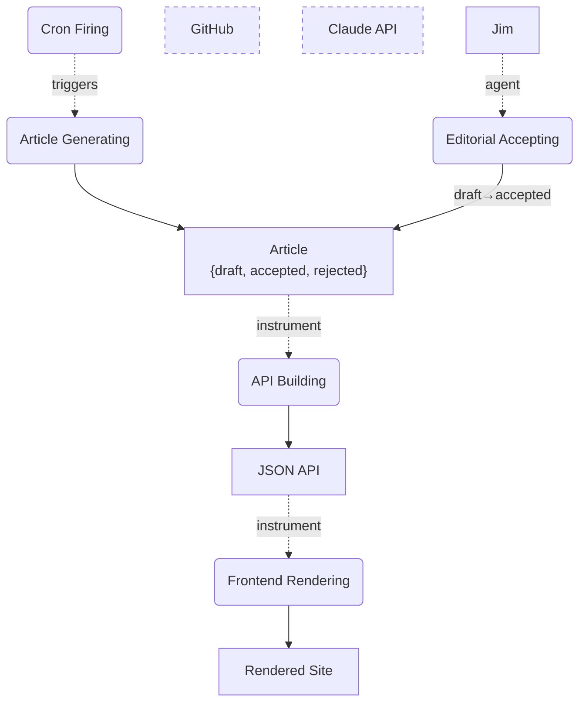
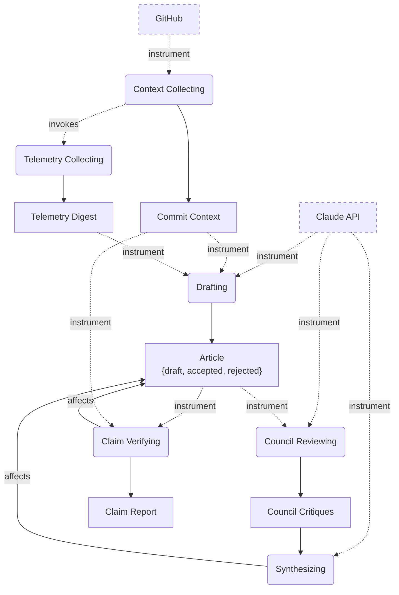

# daily-logger — Object-Process Diagrams

> Rendered from `opm/system.opl` by `/opm render`. Do not hand-edit.
> Notation: rectangles = objects, rounded = processes, dotted `agent`/`instrument` edges = enablers,
> dashed borders = environmental objects.

## SD — daily-logger: one article per day

**OPL paragraph.** Jim is physical. GitHub is environmental. Claude API is environmental. Article
can be draft, accepted, or rejected. Draft is initial. Cron Firing triggers Article Generating.
Article Generating yields Article. Jim handles Editorial Accepting. Editorial Accepting changes
Article from draft to accepted. API Building requires Article. API Building yields JSON API.
Frontend Rendering requires JSON API. Frontend Rendering yields Rendered Site.

## SD1.1 — Article Generating in-zoom

**OPL paragraph.** Article Generating zooms into Context Collecting, Drafting, Council Reviewing,
Synthesizing, and Claim Verifying. Context Collecting requires GitHub. Context Collecting invokes
Telemetry Collecting. Context Collecting yields Commit Context. Telemetry Collecting yields
Telemetry Digest. Drafting requires Claude API. Drafting requires Commit Context. Drafting
requires Telemetry Digest. Drafting yields Article. Council Reviewing requires Claude API.
Council Reviewing requires Article. Council Reviewing yields Council Critiques. Synthesizing
requires Claude API. Synthesizing consumes Council Critiques. Synthesizing affects Article.
Claim Verifying requires Article. Claim Verifying requires Commit Context. Claim Verifying yields
Claim Report. Claim Verifying affects Article.
