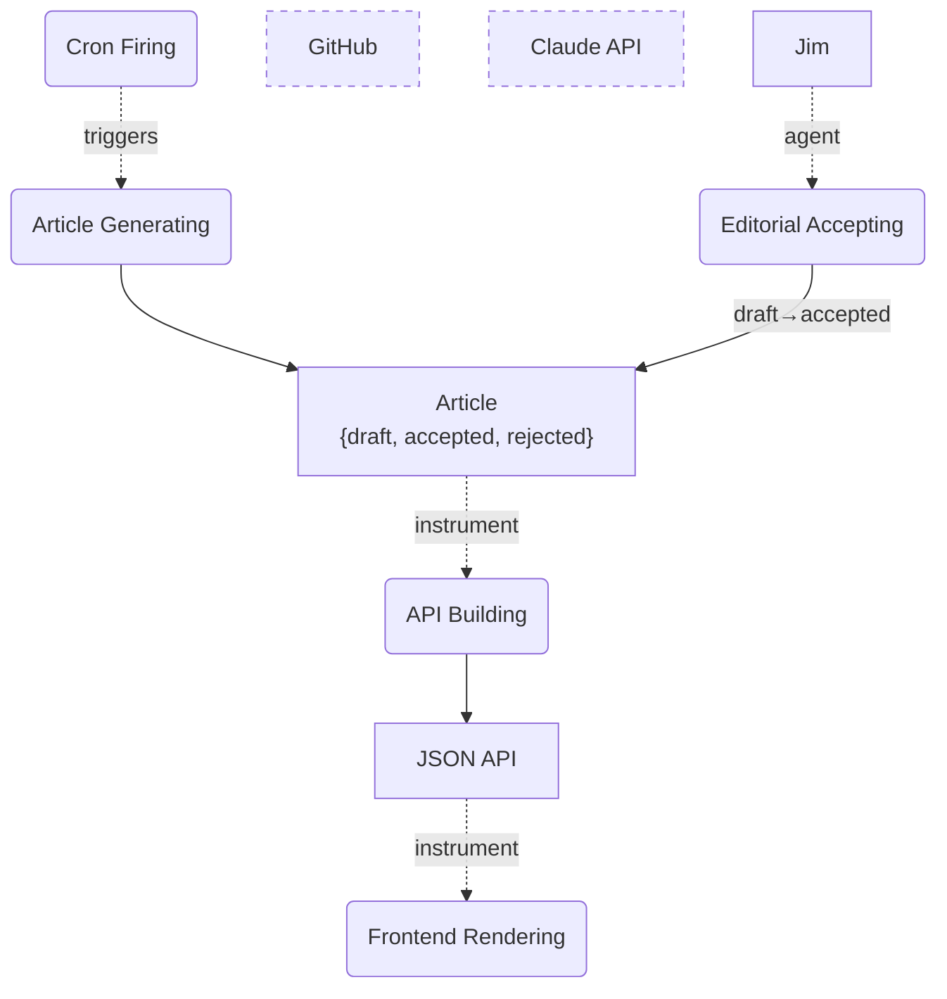
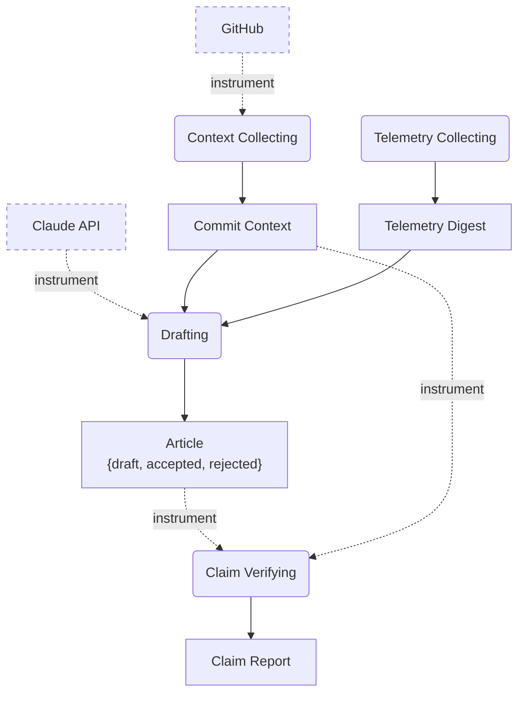

# daily-logger — Object-Process Diagrams

> Rendered from `opm/system.opl` by `/opm render`. Do not hand-edit.
> Notation: rectangles = objects, rounded = processes, dotted `agent`/`instrument` edges = enablers,
> dashed borders = environmental objects.

## SD — daily-logger: one article per day

**OPL paragraph.** Jim is physical. GitHub is environmental. Claude API is environmental. Article
can be draft, accepted, or rejected. Draft is initial. Cron Firing triggers Article Generating.
Article Generating yields Article. Jim handles Editorial Accepting. Editorial Accepting changes
Article from draft to accepted. API Building requires Article. API Building yields JSON API.
Frontend Rendering requires JSON API.

## SD1.1 — Article Generating in-zoom

**OPL paragraph.** Article Generating zooms into Context Collecting, Telemetry Collecting,
Drafting, and Claim Verifying. Context Collecting requires GitHub. Context Collecting yields
Commit Context. Telemetry Collecting yields Telemetry Digest. Drafting requires Claude API.
Drafting consumes Commit Context. Drafting consumes Telemetry Digest. Drafting yields Article.
Claim Verifying requires Article. Claim Verifying requires Commit Context. Claim Verifying yields
Claim Report.
